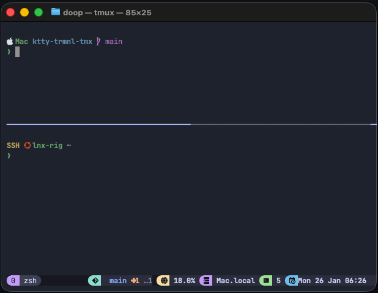

<h1 align="center">A Terminal Worth Stealing</h1>

<p align="center"><em>Your terminal, everywhere.</em></p>

<p align="center">
  
</p>

---

Stop reconfiguring your terminal on every new machine, VM, or SSH session. One clone, one script—your setup works the same on your Mac, your Linux server, and any machine you connect to.

---

## The Problem

You're spending more time in the terminal than ever. Maybe Claude Code pulled you in. Now you're juggling:

- Your Mac
- A Linux server
- A VM for testing
- SSH sessions into who-knows-where

Each one feels different. Each one needs setup. Each one breaks your flow.

## The Solution

```bash
git clone https://github.com/hmbldv/trmnl.git
cd trmnl
./install.sh
```

Three minutes later: same terminal experience everywhere.

---

## What You Get

| Feature | Why It Matters |
|---------|----------------|
| **Always know where you are** | OS icon, hostname, git branch, directory—visible at a glance |
| **Split panes, persistent sessions** | Disconnect from SSH, reconnect later, pick up where you left off |
| **Same setup everywhere** | macOS, Linux, VMs, remote servers—identical muscle memory |
| **Clean, consistent look** | Unified earthy palette across every tool |

---

## Try This After Install

1. Open a new terminal—notice the prompt shows your OS and current folder
2. Navigate to a git repo—watch the branch appear in your prompt
3. Press `Ctrl+A` then `|` to split the screen vertically
4. Press `Ctrl+A` then `h` or `l` to move between panes
5. Type `exit` in one pane to close it

---

## What's Inside

| Tool | What It Does |
|------|--------------|
| **Kitty** | GPU-accelerated terminal with tabs, splits, and image support (optional) |
| **Alacritty** | GPU-accelerated terminal, minimal and fast (optional) |
| **tmux** | Split your screen into panes. Sessions survive disconnects—close the window, come back tomorrow, everything's still there |
| **zsh** | Modern shell with syntax highlighting and suggestions as you type |
| **Starship** | Smart prompt that shows git status, current directory, and OS icon |
| **fzf** | Fuzzy finder for files, history, and anything searchable |
| **zoxide** | Smarter `cd` that learns your most-used directories |
| **gitmux** | Git branch and status in your tmux status bar |
| **fastfetch** | System info displayed on shell startup |

---

## Who This Is For

- Developers spending more time in CLI tools (Claude Code, Cursor, etc.)
- Anyone working across multiple machines or environments
- People who want a better terminal but don't want to become a "dotfiles person"

---

## Why This Exists

I work across a Mac, a Linux server, and VMs. Every new machine was 30-45 minutes of setup before I could focus on actual work. My muscle memory would fight three different configurations.

This repo is my fix. One config that follows me everywhere.

---

## Quick Reference

| Action | Keys |
|--------|------|
| Split vertical | `Ctrl+A` then `\|` |
| Split horizontal | `Ctrl+A` then `-` |
| Move between panes | `Ctrl+A` then `h/j/k/l` |
| Detach (session keeps running) | `Ctrl+A` then `d` |
| Reattach to session | `tmux attach` |

[Full installation guide and shortcuts →](./INSTALLATION.md)

---

## Supported Platforms

| Platform | Status | Recommended Terminal |
|----------|--------|----------------------|
| macOS (Homebrew) | Supported | Kitty or Alacritty |
| Ubuntu / Debian | Supported | Kitty or Alacritty |
| Fedora | Supported | Kitty or Alacritty |
| Arch | Supported | Kitty or Alacritty |
| VMs / SSH | Supported | Native terminal (auto-detected) |
| Windows | Use WSL | Native terminal |

---

## License

MIT

---

*Built for developers who'd rather code than configure.*
